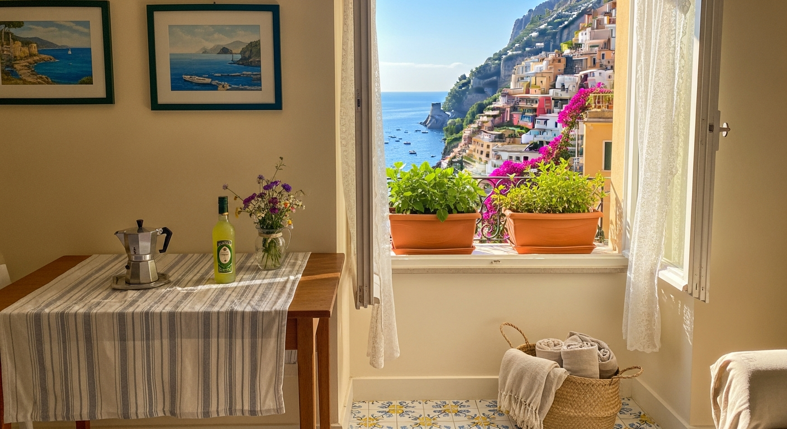
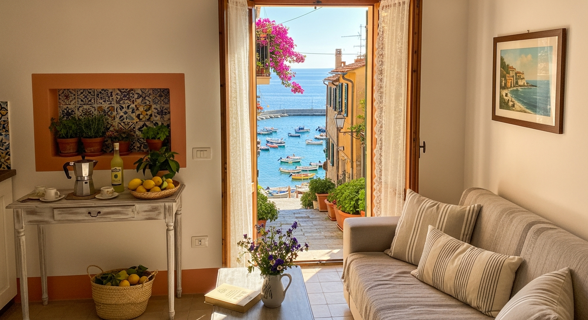
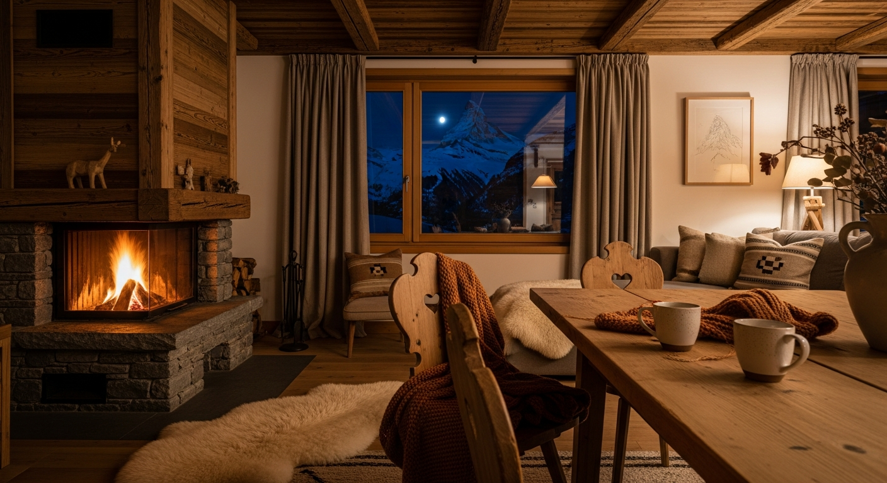
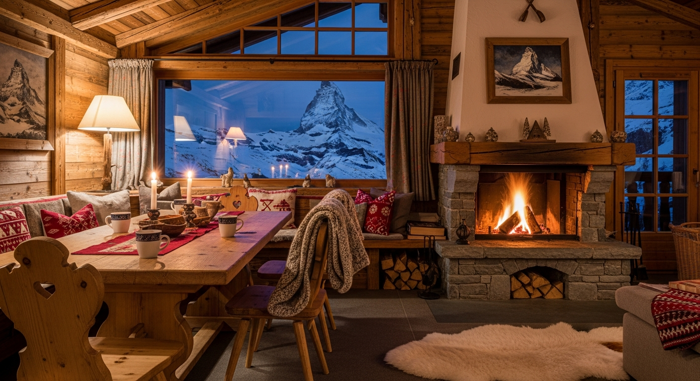
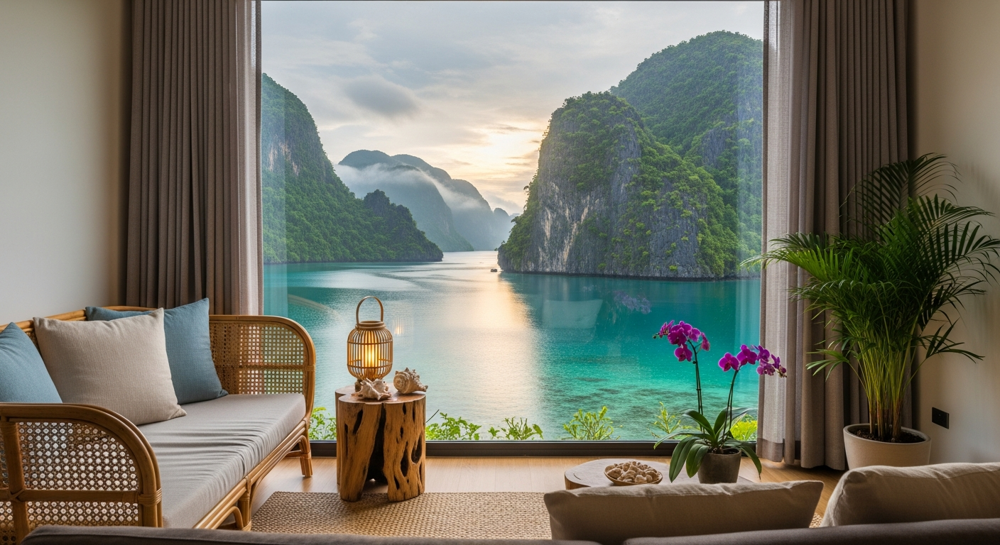

# Mawaku CLI

Mawaku is a command-line interface that will grow into a toolkit for generating video call backgrounds from natural language prompts.
Mawaku (fusion of 間 “ma” = space/pause + 枠 “waku” = frame) aims to simplify the process of creating personalized virtual backgrounds by leveraging AI image generation.

## Example Prompts

> Inspiration for what Mawaku can craft from simple commands.

### Italian Coastal Morning

Run:

```bash
cargo run -p mawaku -- --location "Italian coastal village" --season summer --time-of-day morning
```

Sunlit coastal homes with warm interior touches—perfect for a fresh day-start vibe.

<p align="center">
  
  
</p>

### Santorini Nightscape

Run:

```bash
cargo run -p mawaku -- --location "Santorini, Greece" --season summer --time-of-day night
```

Lantern-lit Santorini interiors with caldera views for a dramatic night backdrop.

<p align="center">
  
  
</p>

### Zermatt Midnight Chalet

Run:

```bash
cargo run -p mawaku -- --location "Zermatt alpine village, Switzerland" --season winter --time-of-day midnight
```

Snow-dusted alpine interiors with Matterhorn views and warm midnight lighting.

<p align="center">
  
  
</p>

### El Nido Monsoon Sunrise

Run:

```bash
cargo run -p mawaku -- --location "El Nido lagoon, Palawan, Philippines" --season monsoon --time-of-day sunrise
```

Tropical lagoon loft awash in sunrise hues framed by karst cliffs and soft rain clouds.

<p align="center">
  
  
</p>

## Getting Started

From the `mawaku-rs/` workspace root, run:

```bash
cargo run -p mawaku -- --help
```

By default the CLI prints the background prompt composed from your inputs. Provide the required location plus optional season and time of day, for example:

```bash
cargo run -p mawaku -- --location "Lisbon, Portugal" --season spring --time-of-day dusk
```

To persist your Gemini API credential, run:

```bash
cargo run -p mawaku -- --set-gemini-api-key "your-secret"
```

The CLI will warn on startup if the `GEMINI_API_KEY` remains empty.

## Docker Usage

Follow these steps to run Mawaku inside Docker with Gemini image generation enabled and images saved to a host directory.

1. **Build the image**

   ```bash
   docker build -f mawaku-rs/Dockerfile -t mawaku-cli mawaku-rs
   ```

2. **Inspect the CLI flags**

   ```bash
   docker run --rm mawaku-cli --help
   ```

3. **Persist your Gemini API key**

   Mount the config directory so the container can store credentials once. Replace `YOUR_GEMINI_KEY` with the key issued by Google.

   ```bash
   mkdir -p .mawaku-config
   docker run --rm \
     -v "$(pwd)/.mawaku-config:/root/.mawaku" \
     mawaku-cli \
     --location "Lisbon, Portugal" \
     --set-gemini-api-key "YOUR_GEMINI_KEY"
   ```

   The command runs a sample prompt and updates `.mawaku-config/config.toml` with your key so later invocations can reuse it.

4. **Choose an output directory for generated images**

   Create a host folder and mount it where the container should write images. Update `image_output_dir` inside `.mawaku-config/config.toml` to match the in-container mount point.

   ```bash
   mkdir -p outputs
   # Open .mawaku-config/config.toml and ensure it contains:
   # gemini_api_key = "YOUR_GEMINI_KEY"
   # image_output_dir = "/workspace/outputs"
   ```

5. **Run a generation**

   ```bash
   docker run --rm \
     -v "$(pwd)/.mawaku-config:/root/.mawaku" \
     -v "$(pwd)/outputs:/workspace/outputs" \
     mawaku-cli \
     --location "Hakone, Japan" \
     --season spring \
     --time-of-day dusk
   ```

   The resulting PNG files land in `./outputs` on the host machine, while prompts and credentials remain under `./.mawaku-config`.

## Configuration

Mawaku persists its defaults in a user-level config file (created on first run) via the `mawaku-config` crate. The file lives at `~/.mawaku/config.toml`, ensuring the CLI keeps its settings directly under your home directory across operating systems. The same file now stores an optional `gemini_api_key` entry so that the CLI can connect to Gemini without prompting for the credential every run.

To reset to the built-in default, delete the config file and rerun the CLI; a fresh file will be created with the stock prompt.

## Development

Rust 1.76+ is recommended. Install the toolchain with [rustup](https://rustup.rs/) and use `cargo check` while building new features.

### Testing

Run the full workspace test suite from the `mawaku-rs/` directory:

```bash
cargo test
```

To target the CLI crate specifically (including its unit tests), run:

```bash
cargo test -p mawaku
```

Append `-- --nocapture` if you want to see the CLI output during test runs.

### Devcontainer usage

The repository ships with a VS Code / Dev Containers setup under `.devcontainer/`. To work inside it:

1. Install Docker and the VS Code Dev Containers extension (or `devcontainer` CLI).
2. Open the repo in VS Code and run **Dev Containers: Reopen in Container**, or execute `devcontainer up --workspace-folder .` from your terminal.
3. The container automatically provisions the Rust toolchain, so you can run `cargo check`, `cargo test`, and other project commands immediately.
4. When you exit the container, your project files remain in the host workspace; rerun step 2 to reattach later.
