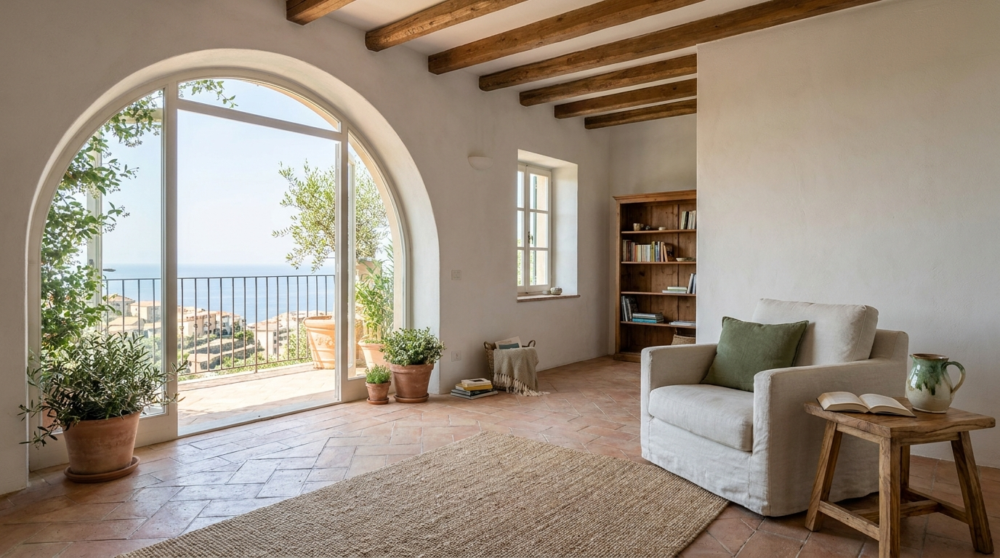
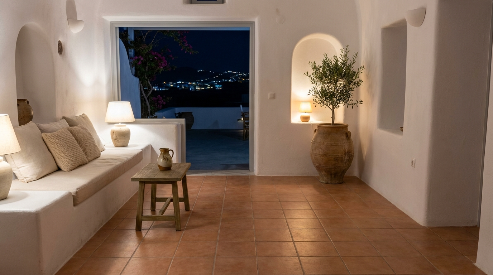
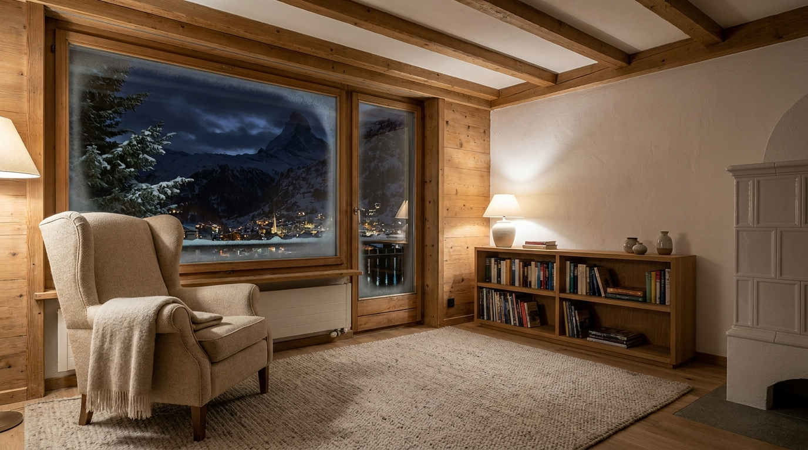
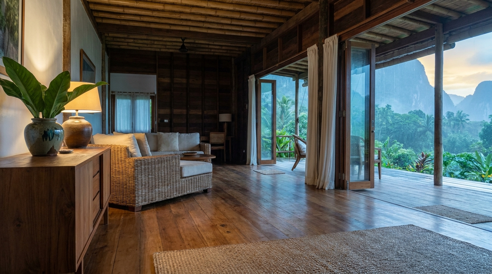
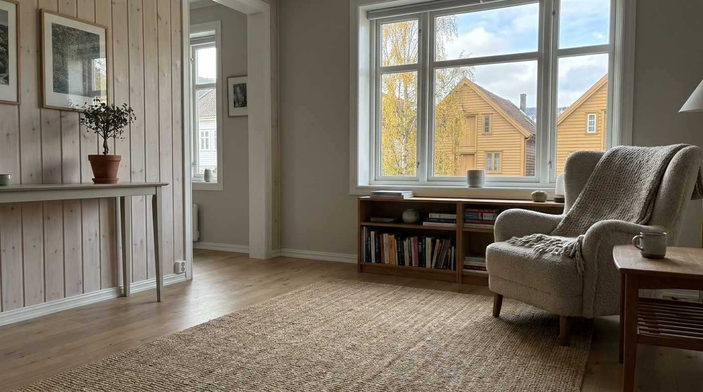
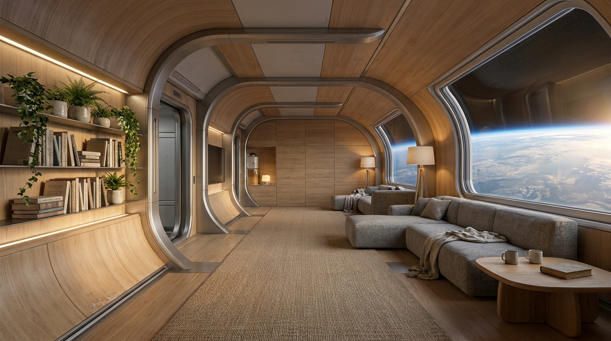

# Mawaku CLI ✨

Craft richly lit video-call backdrops from a single prompt. **Mawaku** (間 *ma* “space, pause” + 枠 *waku* “frame”) is a Rust-powered command-line companion that turns location, season, and time-of-day hints into AI-generated interiors.

---

## Table of Contents
- [Quickstart](#quickstart)
- [Install via Homebrew](#install-via-homebrew)
- [Spotlight Prompts](#spotlight-prompts)
- [Configuration](#configuration)
- [Docker Workflow](#docker-workflow)
- [Development](#development)

---

## Quickstart

> 🧰 **Prerequisite:** Rust 1.76+ with [`rustup`](https://rustup.rs/) installed.

1. **Install dependencies and view the CLI help**

   ```bash
   cd mawaku-rs
   cargo run -p mawaku -- --help
   ```

2. **Generate a prompt (location is required)**

   ```bash
   cargo run -p mawaku -- \
     --location "Lisbon, Portugal" \
     --season spring \
     --time-of-day dusk
   ```

3. **Save your Gemini API key**

   ```bash
   cargo run -p mawaku -- setup
   ```

   Paste the key at the hidden prompt. Mawaku saves it in your user config for future runs.
   With an installed binary, use `mawaku setup`.

Generate up to three variations in one invocation:

```bash
cargo run -p mawaku -- --location "Tokyo, Asakusa" --season autumn --time-of-day morning --count 3
```

`--count` defaults to `1` and accepts only `1`, `2`, or `3`. For multiple images,
Mawaku reuses one place description, distributes different local details across
prompts, and combines them with distinct reading, living-room, and study arrangements.
Location, season, lighting, and webcam framing rules stay consistent. Sparse local
references may be shared, but each arrangement remains different. Visual differences
are encouraged rather than guaranteed by the image model.

Each variant makes a separate, sequential image API request (and incurs its own API
usage). Files use `p1`, `p2`, and `p3`.
A failed variant is reported and the remaining variants are still attempted; there
are no automatic retries. Without an API key, all requested prompts are printed.

### Terminal output

Mawaku shows a compact scene header, animated spinners with elapsed time while
preparing local details and generating each image, and a final saved-file summary.
Completed variants stay visible; failed variants are marked and remaining work continues.
For example (illustrative timings):

```text
  Mawaku
  Tokyo, Asakusa · autumn · morning
  3 image variant(s)

  ✓ Preparing local details — ready (2.1s)
  ✓ 1/3  Reading corner — saved (38.0s)
  ⠋ 2/3  Living room  00:12
```

Use `-v` / `--verbose` to show full prompts and local reference details during
image generation. Prompts are always printed when no generation is possible or
stdout is redirected, so `> prompts.txt` keeps working. Status output goes to stderr.
Redirected stderr uses plain progress lines without animation. Set `NO_COLOR=1`
to disable colors; `TERM=dumb` also disables animation.

Preview the progress UI, including a simulated failure, without API calls:

```bash
cargo run -p mawaku-utils --example progress
```

---

## Install via Homebrew

macOS (Apple Silicon or Intel) and Linux (x86_64 or arm64) users can skip the Rust toolchain entirely and install a prebuilt binary via the project's Homebrew tap:

```bash
brew tap Bennoo/tap
brew install mawaku
```

> **First-time tap trust:** on newer Homebrew versions, a tap you haven't used before may
> need an explicit one-time trust grant before its formulas will load:
> ```bash
> brew trust Bennoo/tap
> ```
> If `brew install` reports the tap as untrusted, run this once, then retry.

Save your Gemini API key (stored in `~/.mawaku/config.toml`, see [Configuration](#configuration)):

```bash
mawaku setup
```

Then generate a background:

```bash
mawaku --location "Lisbon, Portugal" --season spring --time-of-day dusk
```

To upgrade to the latest release later:

```bash
brew update && brew upgrade mawaku
```

---

## Precompiled Linux binaries

Prefer not to install Rust? Every GitHub Release publishes ready-to-run archives built by CI. Pick the archive that matches your host CPU and follow the steps below.


```bash
TAG=v0.0.1          # replace with the release you want
```

### x86_64 hosts
```bash
ASSET=mawaku-${TAG}-linux-x86_64.tar.gz
```

### ARM64 hosts (e.g., dev container on Apple Silicon)

```bash
ASSET=mawaku-${TAG}-linux-arm64.tar.gz
```

### Download, extract, and install
```bash
curl -L -o "$ASSET" "https://github.com/Bennoo/mawaku-cli/releases/download/${TAG}/${ASSET}"
mkdir -p ~/.local/bin
tar -xzf "$ASSET" -C ~/.local/bin mawaku
chmod +x ~/.local/bin/mawaku
```

Move the extracted `mawaku` binary anywhere on your `PATH` (for example, `/usr/local/bin` or `~/.local/bin`) to invoke it from any directory.

```bash
export PATH="$HOME/.local/bin:$PATH"
mawaku --help
```


---

## Spotlight Prompts

These examples use the updated framing: broad exterior openings with more room
for the view, while keeping the foreground clear for the caller. Run each command
from the `mawaku-rs/` workspace root.

### Italian Coastal Morning

An inviting coastal living room in soft summer morning light.

```bash
cargo run -p mawaku -- --location "Italian coastal village" --season summer --time-of-day morning
```



### Santorini Nightscape

A comfortable island interior with restrained warm lamps and a nighttime exterior.

```bash
cargo run -p mawaku -- --location "Santorini, Greece" --season summer --time-of-day night
```



### Zermatt Midnight Chalet

A lived-in alpine room with warm indoor lighting on a winter night.

```bash
cargo run -p mawaku -- --location "Zermatt alpine village, Switzerland" --season winter --time-of-day midnight
```



### El Nido Monsoon Sunrise

A tropical home overlooking the local landscape at monsoon sunrise.

```bash
cargo run -p mawaku -- --location "El Nido lagoon, Palawan, Philippines" --season monsoon --time-of-day sunrise
```



### Bergen Harbor Morning

A cozy Norwegian home with soft autumn light and a glimpse of colorful waterfront houses.

```bash
cargo run -p mawaku -- \
  --location "Bergen, Norway, a cozy harbor-side home with a subtle view of colorful wooden waterfront houses" \
  --season autumn \
  --time-of-day morning
```



### Earth Orbit Lounge · Fantasy

A fictional space-station living room with curved observation windows overlooking Earth at orbital sunrise.

```bash
cargo run -p mawaku -- \
  --location "A fictional space station orbiting Earth, a spacious lived-in residential lounge with curved observation windows showing the blue Earth and its atmospheric rim against space; retain the orbital setting rather than an Earth-based house" \
  --time-of-day "orbital sunrise, soft sunlight on Earth and restrained warm interior lighting"
```



All six examples were generated with the CLI using the commands above and the default
single-image count. Re-running them produces new variations.

---

## Configuration

The image prompt uses a level webcam at seated eye height, looking into a spacious,
lived-in room with furniture several metres away and a quiet centre for the caller's
head and torso. The foreground and bottom edge show only clear floor or a flat rug;
the desk, monitor, and caller's chair stay entirely outside the frame behind the camera.
Comfortable seating and tactile natural materials make the space inviting. A broad
window, glazed doors or a terrace opening occupies roughly one third of the image
width to one side, giving the exterior a substantial, unobstructed place in the
composition. Balanced exposure preserves outdoor detail and a readable interior;
glazing or enclosure stays appropriate to the weather and setting.
Local references are limited to a few subtle residential details. `--time-of-day`
controls indoor lighting and the exterior view; omitted timing defaults to soft,
overcast daytime light. The prompt avoids dramatic HDR lighting and staged showroom styling.

The base image instructions are defined in `mawaku-rs/mawaku-config/src/lib.rs`
(`DEFAULT_PROMPT`), not in the generated config file. Re-run `cargo run` after editing
them to rebuild the CLI and generate a new background.

Mawaku writes persistent settings to `~/.mawaku/config.toml` the first time you run the CLI. Key entries include:

| Key / Section       | Purpose                                                                                      |
| ------------------- | -------------------------------------------------------------------------------------------- |
| `[gemini_api]`      | Stores the optional API key and the environment variable override name.                               |
| `image_output_dir`  | Directory (inside or outside Docker) for rendered assets.                                    |

> **Gemini credentials**
>
> Run `mawaku setup` to save or replace `[gemini_api].api_key` using hidden terminal input.
> The key is stored in plain text in `~/.mawaku/config.toml` on Linux and macOS, or
> `%USERPROFILE%\.mawaku\config.toml` on Windows. On Unix, the file is restricted to
> its owner (`0600`); on Windows, it inherits the user directory's access permissions.
> Setup uses the same user config regardless of how the binary was installed,
> including source builds and macOS Homebrew installations. It does not validate the
> key with Gemini or generate an image. An empty entry leaves the saved key unchanged.
>
> A nonempty environment variable takes precedence over the saved key. Its name is
> configured by `[gemini_api].api_key_env_var` and defaults to `GEMINI_API_KEY`.
> For containers or noninteractive runs, use `export GEMINI_API_KEY="your-key"`
> (Bash/Zsh) or `$env:GEMINI_API_KEY="your-key"` (PowerShell).
> To remove the saved key, delete the `api_key` entry from the config file.


> **Image output directory**
>
> `image_output_dir` remains at the root of the file for backward compatibility: older Mawaku releases only understood this top-level key, so keeping it there avoids breaking existing configs while still letting you edit the path manually.

To revert to defaults, delete the file and re-run any Mawaku command; a fresh template is generated automatically.

---

## Docker Workflow

Run Mawaku inside an isolated container while keeping prompts, credentials, and images on the host:

1. **Build the image**

   ```bash
   docker build -f mawaku-rs/Dockerfile -t mawaku-cli mawaku-rs
   ```

2. **Prime configuration and credentials**

   ```bash
   mkdir -p .mawaku-config
   docker run --rm \
     -e GEMINI_API_KEY="YOUR_GEMINI_KEY" \
     -v "$(pwd)/.mawaku-config:/root/.mawaku" \
     mawaku-cli \
     --location "Lisbon, Portugal"
   ```

3. **Choose an output directory**

   ```bash
   mkdir -p outputs
   # Ensure .mawaku-config/config.toml contains:
   # [gemini_api]
   # api_key_env_var = "GEMINI_API_KEY"
   # image_output_dir = "/workspace/outputs"
   ```

4. **Render a scene**

   ```bash
   docker run --rm \
     -v "$(pwd)/.mawaku-config:/root/.mawaku" \
     -v "$(pwd)/outputs:/workspace/outputs" \
     mawaku-cli \
     --location "Hakone, Japan" \
     --season spring \
     --time-of-day dusk
   ```

Resulting PNGs appear in `./outputs`, while Mawaku keeps credentials under `./.mawaku-config` for future runs.

---

## Development

### Local toolchain

- Install Rust 1.76+ via `rustup`.
- Use `cargo check` to iterate quickly and catch type errors early.

### Testing

```bash
cargo test           # full workspace
cargo test -p mawaku # CLI crate only
```

Append `-- --nocapture` to either command to see CLI stdout during tests.

### Dev Container

The repo includes `.devcontainer/` for a ready-to-code environment:

1. Install Docker and the VS Code **Dev Containers** extension (or the `devcontainer` CLI).
2. Reopen the project in the container (`Dev Containers: Reopen in Container` or `devcontainer up --workspace-folder .`).
3. The container ships with the Rust toolchain, so you can immediately run `cargo check`, `cargo test`, or `cargo run` without extra setup.
4. Exit the container any time—your project files stay on the host machine.
