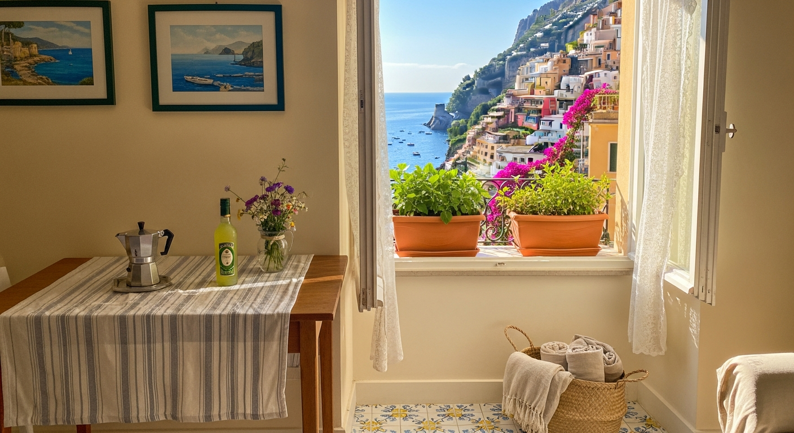
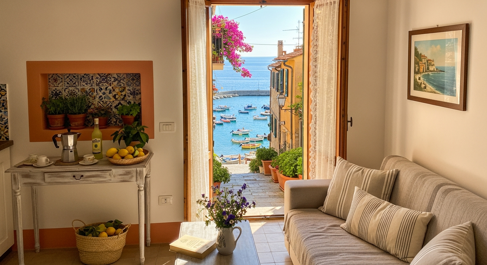
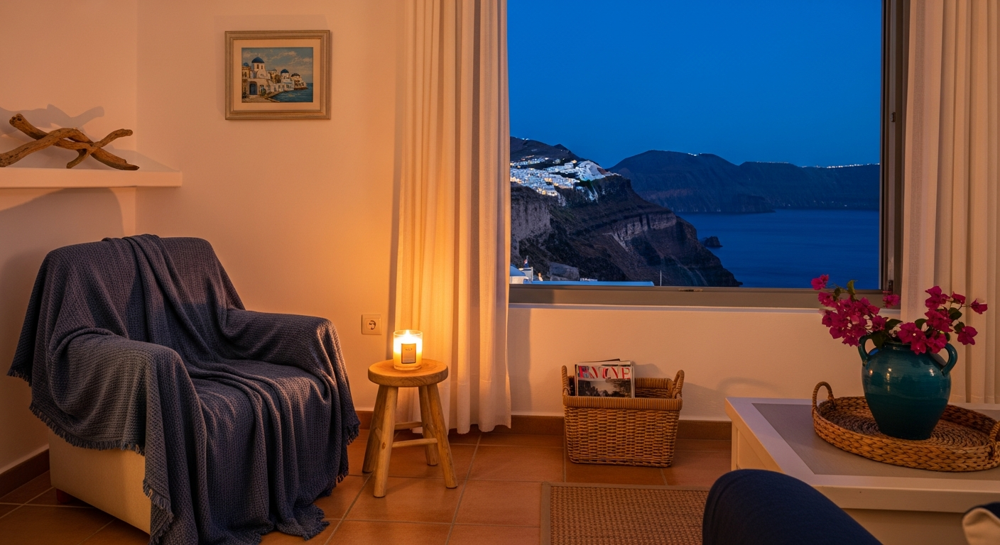
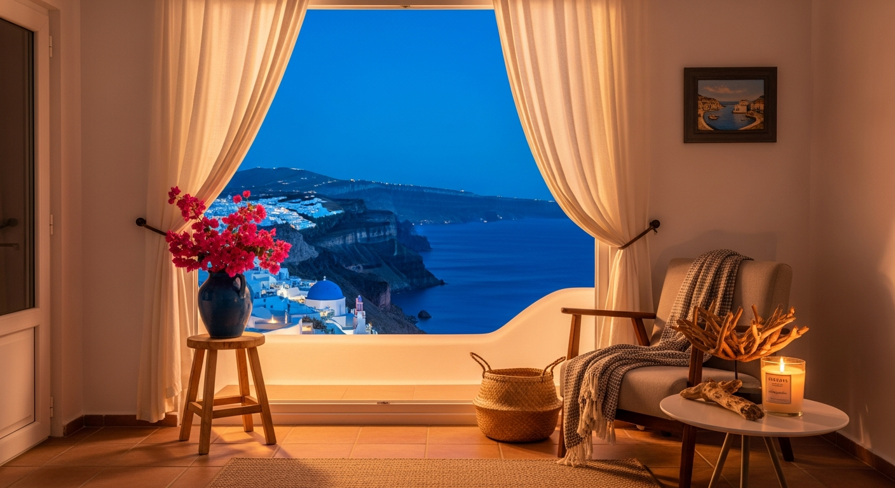
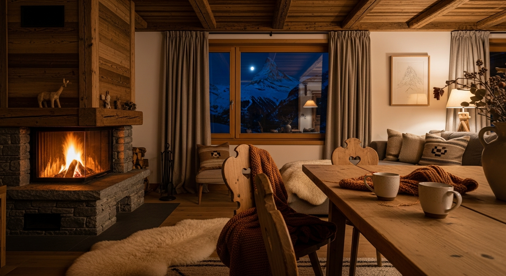
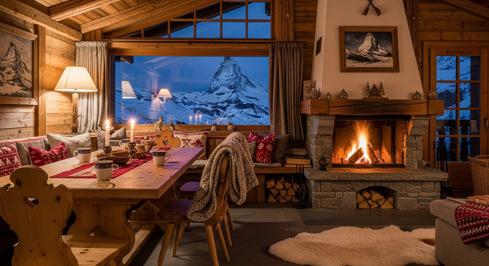
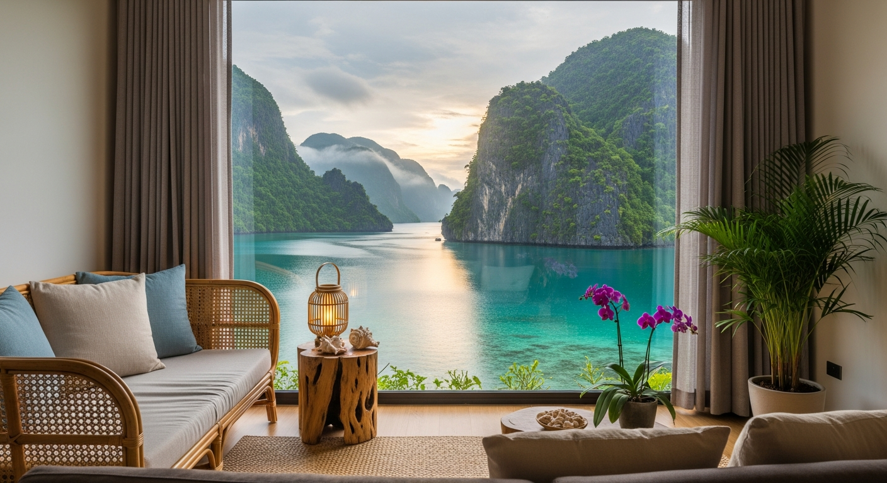
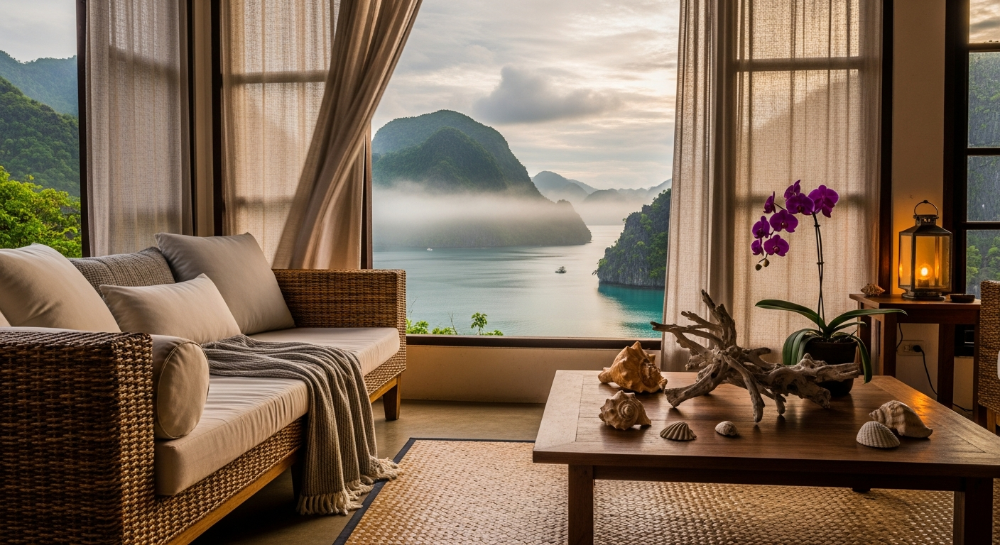

# Mawaku CLI ✨

Craft richly lit video-call backdrops from a single prompt. **Mawaku** (間 *ma* “space, pause” + 枠 *waku* “frame”) is a Rust-powered command-line companion that turns location, season, and time-of-day hints into AI-generated interiors.

---

## Table of Contents
- [Quickstart](#quickstart)
- [Spotlight Prompts](#spotlight-prompts)
- [Configuration](#configuration)
- [Docker Workflow](#docker-workflow)
- [Development](#development)

---

## Quickstart

> 🧰 **Prerequisite:** Rust 1.76+ with [`rustup`](https://rustup.rs/) installed.

1. **Install dependencies and view the CLI help**

   ```bash
   cd mawaku-rs
   cargo run -p mawaku -- --help
   ```

2. **Generate a prompt (location is required)**

   ```bash
   cargo run -p mawaku -- \
     --location "Lisbon, Portugal" \
     --season spring \
     --time-of-day dusk
   ```

3. **Export your Gemini API key once**

   ```bash
   export GEMINI_API_KEY="your-secret"
   ```

   Mawaku reads this variable each time it runs (and warns loudly if it is absent), so you never have to edit the config with raw secrets.

Generate up to three variations in one invocation:

```bash
cargo run -p mawaku -- --location "Tokyo, Asakusa" --season autumn --time-of-day morning --count 3
```

`--count` defaults to `1` and accepts only `1`, `2`, or `3`. For multiple images,
Mawaku reuses one place description, distributes different local details across
prompts, and combines them with distinct reading, living-room, and study arrangements.
Location, season, lighting, and webcam framing rules stay consistent. Sparse local
references may be shared, but each arrangement remains different. Visual differences
are encouraged rather than guaranteed by the image model.

Each variant makes a separate, sequential image API request (and incurs its own API
usage). Files use `p1`, `p2`, and `p3`.
A failed variant is reported and the remaining variants are still attempted; there
are no automatic retries. Without an API key, all requested prompts are printed.

### Terminal output

Mawaku shows a compact scene header, animated spinners with elapsed time while
preparing local details and generating each image, and a final saved-file summary.
Completed variants stay visible; failed variants are marked and remaining work continues.
For example (illustrative timings):

```text
  Mawaku
  Tokyo, Asakusa · autumn · morning
  3 image variant(s)

  ✓ Preparing local details — ready (2.1s)
  ✓ 1/3  Reading corner — saved (38.0s)
  ⠋ 2/3  Living room  00:12
```

Use `-v` / `--verbose` to show full prompts and local reference details during
image generation. Prompts are always printed when no generation is possible or
stdout is redirected, so `> prompts.txt` keeps working. Status output goes to stderr.
Redirected stderr uses plain progress lines without animation. Set `NO_COLOR=1`
to disable colors; `TERM=dumb` also disables animation.

Preview the progress UI, including a simulated failure, without API calls:

```bash
cargo run -p mawaku-utils --example progress
```

---

## Precompiled Linux binaries

Prefer not to install Rust? Every GitHub Release publishes ready-to-run archives built by CI. Pick the archive that matches your host CPU and follow the steps below.


```bash
TAG=v0.0.1          # replace with the release you want
```

### x86_64 hosts
```bash
ASSET=mawaku-${TAG}-linux-x86_64.tar.gz
```

### ARM64 hosts (e.g., dev container on Apple Silicon)

```bash
ASSET=mawaku-${TAG}-linux-arm64.tar.gz
```

### Download, extract, and install
```bash
curl -L -o "$ASSET" "https://github.com/Bennoo/mawaku-cli/releases/download/${TAG}/${ASSET}"
mkdir -p ~/.local/bin
tar -xzf "$ASSET" -C ~/.local/bin mawaku
chmod +x ~/.local/bin/mawaku
```

Move the extracted `mawaku` binary anywhere on your `PATH` (for example, `/usr/local/bin` or `~/.local/bin`) to invoke it from any directory.

```bash
export PATH="$HOME/.local/bin:$PATH"
mawaku --help
```


---

## Spotlight Prompts

Get inspired by a few curated scenes. Each command runs from the `mawaku-rs/` workspace root.

<table>
  <tr>
    <th>Scene</th>
    <th>Command</th>
    <th>Mood</th>
  </tr>
  <tr>
    <td><strong>Italian Coastal Morning</strong></td>
    <td><code>cargo run -p mawaku -- --location "Italian coastal village" --season summer --time-of-day morning</code></td>
    <td>Sunlit cliffside homes and warm café interiors for breezy AM energy.</td>
  </tr>
  <tr>
    <td colspan="3" align="center">
      
      
    </td>
  </tr>
  <tr>
    <td><strong>Santorini Nightscape</strong></td>
    <td><code>cargo run -p mawaku -- --location "Santorini, Greece" --season summer --time-of-day night</code></td>
    <td>Lantern-lit terraces with caldera views for dramatic twilight calls.</td>
  </tr>
  <tr>
    <td colspan="3" align="center">
      
      
    </td>
  </tr>
  <tr>
    <td><strong>Zermatt Midnight Chalet</strong></td>
    <td><code>cargo run -p mawaku -- --location "Zermatt alpine village, Switzerland" --season winter --time-of-day midnight</code></td>
    <td>Snow-dusted timber chalets with Matterhorn silhouettes and ember glow.</td>
  </tr>
  <tr>
    <td colspan="3" align="center">
      
      
    </td>
  </tr>
  <tr>
    <td><strong>El Nido Monsoon Sunrise</strong></td>
    <td><code>cargo run -p mawaku -- --location "El Nido lagoon, Palawan, Philippines" --season monsoon --time-of-day sunrise</code></td>
    <td>Tropical loft wrapped in sunrise haze and karst cliffs after summer rain.</td>
  </tr>
  <tr>
    <td colspan="3" align="center">
      
      
    </td>
  </tr>
</table>

---

## Configuration

The image prompt uses a level webcam at seated eye height, looking into a spacious,
lived-in room with furniture several metres away and a quiet centre for the caller's
head and torso. The foreground and bottom edge show only clear floor or a flat rug;
the desk, monitor, and caller's chair stay entirely outside the frame behind the camera.
Comfortable seating, tactile natural materials and a restrained local view make the
space inviting while retaining believable proportions and everyday character.
Local references are limited to a few subtle residential details. `--time-of-day`
controls indoor lighting and the exterior view; omitted timing defaults to soft,
overcast daytime light. The prompt avoids dramatic HDR lighting and staged showroom styling.

The base image instructions are defined in `mawaku-rs/mawaku-config/src/lib.rs`
(`DEFAULT_PROMPT`), not in the generated config file. Re-run `cargo run` after editing
them to rebuild the CLI and generate a new background.

Mawaku writes persistent settings to `~/.mawaku/config.toml` the first time you run the CLI. Key entries include:

| Key / Section       | Purpose                                                                                      |
| ------------------- | -------------------------------------------------------------------------------------------- |
| `prompt`            | Baseline template the CLI enriches with your inputs.                                         |
| `[gemini_api]`      | Tracks the environment variable that stores the Gemini API key.                               |
| `image_output_dir`  | Directory (inside or outside Docker) for rendered assets.                                    |

> **Gemini credentials**
>
> Mawaku never writes the Gemini API key to disk. Instead, `[gemini_api]` keeps a single entry: `api_key_env_var`. It defaults to `GEMINI_API_KEY`, but you can edit the config file to point to any environment variable name you prefer (for example, `GEMINI_KEY`). Make sure that variable is exported before invoking the CLI.

> **Image output directory**
>
> `image_output_dir` remains at the root of the file for backward compatibility: older Mawaku releases only understood this top-level key, so keeping it there avoids breaking existing configs while still letting you edit the path manually.

To revert to defaults, delete the file and re-run any Mawaku command; a fresh template is generated automatically.

---

## Docker Workflow

Run Mawaku inside an isolated container while keeping prompts, credentials, and images on the host:

1. **Build the image**

   ```bash
   docker build -f mawaku-rs/Dockerfile -t mawaku-cli mawaku-rs
   ```

2. **Prime configuration and credentials**

   ```bash
   mkdir -p .mawaku-config
   docker run --rm \
     -e GEMINI_API_KEY="YOUR_GEMINI_KEY" \
     -v "$(pwd)/.mawaku-config:/root/.mawaku" \
     mawaku-cli \
     --location "Lisbon, Portugal"
   ```

3. **Choose an output directory**

   ```bash
   mkdir -p outputs
   # Ensure .mawaku-config/config.toml contains:
   # [gemini_api]
   # api_key_env_var = "GEMINI_API_KEY"
   # image_output_dir = "/workspace/outputs"
   ```

4. **Render a scene**

   ```bash
   docker run --rm \
     -v "$(pwd)/.mawaku-config:/root/.mawaku" \
     -v "$(pwd)/outputs:/workspace/outputs" \
     mawaku-cli \
     --location "Hakone, Japan" \
     --season spring \
     --time-of-day dusk
   ```

Resulting PNGs appear in `./outputs`, while Mawaku keeps credentials under `./.mawaku-config` for future runs.

---

## Development

### Local toolchain

- Install Rust 1.76+ via `rustup`.
- Use `cargo check` to iterate quickly and catch type errors early.

### Testing

```bash
cargo test           # full workspace
cargo test -p mawaku # CLI crate only
```

Append `-- --nocapture` to either command to see CLI stdout during tests.

### Dev Container

The repo includes `.devcontainer/` for a ready-to-code environment:

1. Install Docker and the VS Code **Dev Containers** extension (or the `devcontainer` CLI).
2. Reopen the project in the container (`Dev Containers: Reopen in Container` or `devcontainer up --workspace-folder .`).
3. The container ships with the Rust toolchain, so you can immediately run `cargo check`, `cargo test`, or `cargo run` without extra setup.
4. Exit the container any time—your project files stay on the host machine.
